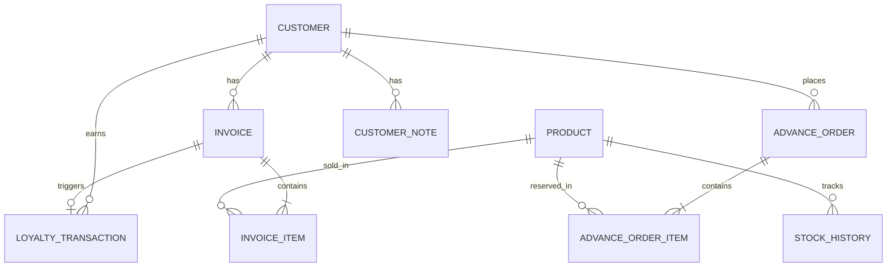

# Database Design Specification (DDS)

This document outlines the PostgreSQL database schema managed via Prisma ORM.

## 1. Entity Relationship Diagram

## 2. Core Tables

### `customers`
- **id** (UUID, PK)
- **phone** (String, Unique, Indexed)
- **vip_level** (String, default "NONE", Indexed)
- **loyalty_points** (Int)
- **total_spending**, **total_visits**, **average_bill** (Float)

### `products`
- **id** (UUID, PK)
- **name**, **category**, **unit** (String)
- **price**, **gst**, **stock**, **minimum_stock** (Float)
- **status** (String, Indexed)

### `invoices`
- **id** (UUID, PK)
- **invoice_number** (String, Unique, Indexed)
- **customer_id** (UUID, FK -> customers)
- **grand_total**, **subtotal**, **gst** (Float)
- **status** (String)

### `invoice_items`
- **id** (UUID, PK)
- **invoice_id** (UUID, FK -> invoices)
- **product_id** (UUID, FK -> products)
- **quantity**, **price**, **total** (Float)

### `advance_orders`
- **id** (UUID, PK)
- **pickup_date** (Date)
- **advance_paid**, **remaining_amount** (Float)
- **status** (String)

## 3. Configuration & Marketing

### `settings`
Global business constraints.
- **id** (String, PK)
- **gold_spending**, **platinum_spending**, **diamond_spending** (Float)
- **points_per_rupee** (Float)

### `offers`
- **id** (UUID, PK)
- **discount_type**, **discount_value** (String/Float)
- **applicable_vips** (String Array)

## 4. Constraints & Indexes
- **Unique Constraints**: `Customer.phone`, `User.email`, `Invoice.invoice_number`.
- **Foreign Key Constraints**: Handled implicitly by Prisma. Deletion of a parent (e.g., Customer) is restricted if associated transactional records (Invoices) exist to preserve financial integrity.
- **Enums**: Emulated via String constraints mapped at the application level (e.g., VIP Levels: `NONE`, `GOLD`, `PLATINUM`, `DIAMOND`).
