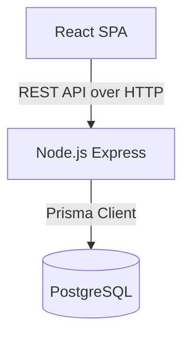

# Software Design Document (SDD)

## 1. Architecture Overview
Sweetbook utilizes a modern, decoupled Client-Server architecture. The frontend is a Single Page Application (SPA) communicating with a RESTful Node.js backend, persisting data in a PostgreSQL database via Prisma ORM.



## 2. Technology Stack
### Frontend
- **Framework**: React 19 + Vite
- **Language**: TypeScript
- **State Management**: TanStack Query (React Query)
- **Styling**: Tailwind CSS, CSS Variables (Domain-specific theming)
- **UI Components**: shadcn/ui, Radix UI, Lucide Icons, framer-motion (for animations)
- **Routing**: React Router DOM

### Backend
- **Runtime**: Node.js
- **Framework**: Express.js
- **Language**: TypeScript
- **ORM**: Prisma
- **Database**: PostgreSQL
- **Authentication**: JWT (JSON Web Tokens), bcrypt
- **Validation**: Zod

## 3. Folder Structure

### Frontend (`/frontend`)
```
src/
├── components/      # Reusable UI elements and charts (Shadcn UI, Thermal Receipt)
├── layouts/         # Page layouts (MainLayout with sidebar)
├── pages/           # Route components (Dashboard, Billing, Customers)
├── services/        # Axios API configurations
├── App.tsx          # Router configuration
└── index.css        # Global CSS variables for branding
```

### Backend (`/backend`)
```
src/
├── controllers/     # Route handlers (Business logic execution)
├── middleware/      # JWT auth, Error handling
├── routes/          # Express route definitions
└── server.ts        # Express application bootstrap
prisma/
├── schema.prisma    # Database models
└── seed.ts          # Robust demo data generator
```

## 4. Component Hierarchy & Data Flow
Data mutations are strictly isolated. The `Billing.tsx` page acts as the heaviest orchestrator, utilizing multiple `useQuery` hooks to fetch customer contexts and a massive `useMutation` to post the final cart state. 

Optimistic UI updates are utilized for basic CRUD (e.g., adding a customer), while critical transactional data (Invoices) rely on server validation before UI updates.

## 5. Security & Authentication
- All backend routes (except login) require a Bearer token.
- Passwords are salted and hashed using bcrypt.
- CORS is restricted in production.
